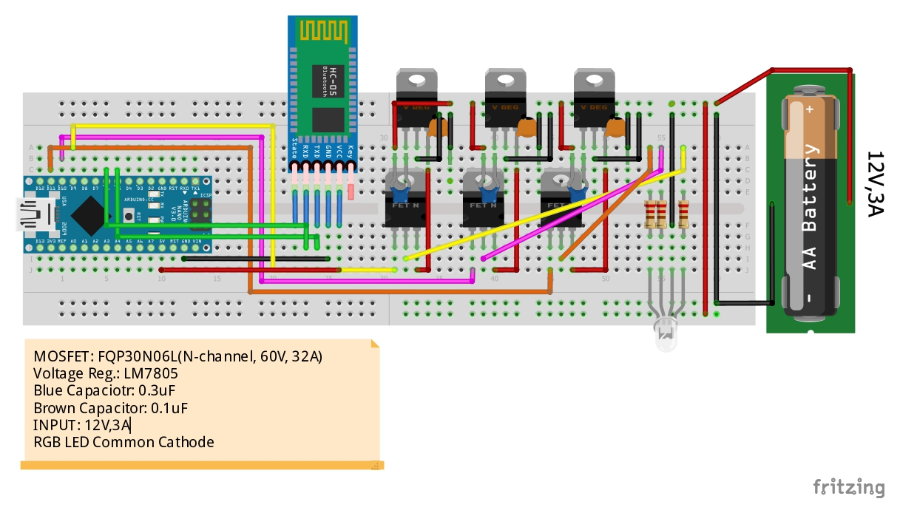
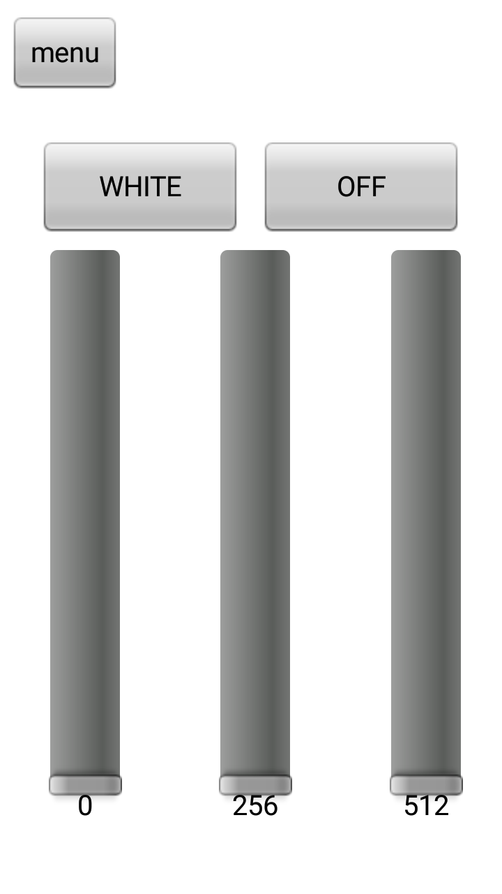

# Smart LED Bulb
**A smart LED mood lightbulb built using Open-Source Technologies at half the market price**  
This bulb is an easy build and uses the following technologies:  
* Arduino Nano
* HC-05 Bluetooth Module
* N-channel Logic Level MOSFET
* Voltage Regulator
* [RoboRemo App](https://www.roboremo.com/)
* 3W RGB LED  
### **So why make this?**
***
As per the market research, I had notice that the so-called "Smart LED Bulbs" companies like Syska and Phillips were selling could easily be made with an inexpensive Arduino with a Bluetooth module.  
As for the App interaction, both RoboRemo and [Blynk](https://blynk.io/) can be used to deploy both over local Bluetooth or even Wi-Fi.  
### **Circuit Diagram**
> 
> [Made using Fritzing](https://fritzing.org/download/)

### **Sample App Interface using RoboRemo Free App**
>  

### **Future Prospects**
***
> * We can make this concept into a Wi-Fi controlled LED Light using ESP8266 nodeMCU
> * The app integration may be through [IFTTT Webhooks](https://ifttt.com/maker_webhooks) or Blynk